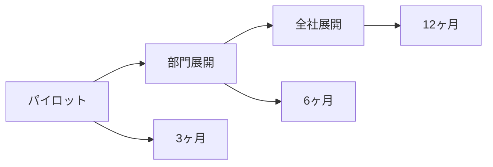

# 📊 実例：プロジェクト変革事例

> 実際のプロジェクトでClaude Codeがもたらした変革

## Case 1: スタートアップの爆速MVP開発

### 背景
- 企業: ソーシャルメディア分析スタートアップ
- チーム: 開発者2名
- 期限: 1週間でMVP構築
- 技術: Next.js, Supabase, Vercel

### 実施内容

```bash
# Day 1: アーキテクチャ設計
> ultrathink: ソーシャルメディア分析ツールのアーキテクチャを設計してください
> Next.js 14, Supabase, Vercelを使用します

# Day 2-3: バックエンド実装
> Supabaseのスキーマを設計してください
> 認証システムを実装してください
> APIエンドポイントを作成してください

# Day 4-5: フロントエンド実装
> ダッシュボードUIを作成してください
> グラフ表示にはRechartsを使用してください
> レスポンシブデザインにしてください

# Day 6: テストとバグ修正
> E2Eテストを作成してください
> 発見されたバグを全て修正してください

# Day 7: デプロイと最適化
> Vercelにデプロイしてください
> Lighthouse スコアを90以上にしてください
```

### 成果

| 指標 | 目標 | 実績 |
|-----|------|------|
| 開発期間 | 1週間 | 7日 |
| 機能完成度 | MVP | 100% |
| バグ数 | 10件以下 | 3件 |
| パフォーマンス | 良好 | Lighthouse 94 |
| コスト | $10,000 | $3,000 |

### 学んだこと
- 明確な要件定義が成功の鍵
- 段階的な実装で品質を保証
- Claude Codeは設計から実装まで一貫してサポート

---

## Case 2: レガシーコードのモダナイゼーション

### 背景
- 企業: 中規模ECサイト
- 課題: jQuery依存の10年物のコード
- 目標: React移行（3ヶ月→3週間に短縮）

### 実施内容

```bash
# Phase 1: 分析と計画（3日）
/init
> プロジェクト全体を分析して、jQueryの使用箇所をリストアップしてください
> React移行の優先順位を提案してください

# Phase 2: 段階的移行（2週間）
> 優先度1のコンポーネントから順にReactに変換してください
> 既存の機能を維持しながら移行してください
> 各コンポーネントにテストを追加してください

# Phase 3: 最適化と仕上げ（4日）
> パフォーマンスを最適化してください
> 不要なjQuery依存を削除してください
> ドキュメントを更新してください
```

### 移行戦略

```javascript
// 段階的移行の例
// Step 1: jQueryコンポーネントをラップ
const LegacyComponent = () => {
  useEffect(() => {
    // 既存のjQueryコード
    $('#old-element').doSomething();
  }, []);
  
  return <div id="old-element" />;
};

// Step 2: 徐々にReact化
const ModernComponent = () => {
  const [state, setState] = useState();
  // Pure React実装
};
```

### 成果

| 指標 | 移行前 | 移行後 | 改善率 |
|------|--------|--------|--------|
| 開発期間 | 3ヶ月予定 | 3週間 | 75%短縮 |
| バンドルサイズ | 2.5MB | 980KB | 60%削減 |
| ページロード時間 | 4.2秒 | 1.3秒 | 69%改善 |
| メンテナンス工数 | 40時間/月 | 10時間/月 | 75%削減 |

---

## Case 3: AIを活用した品質向上

### 背景
- 企業: フィンテック企業
- 課題: テストカバレッジ30%
- 目標: 85%達成（1週間で）

### 実施内容

```bash
# Step 1: 現状分析
> テストカバレッジレポートを生成してください
> テストが不足している重要な部分を特定してください

# Step 2: テスト戦略
> 優先度の高い順にテスト計画を作成してください
> ユニットテスト、統合テスト、E2Eテストに分類してください

# Step 3: 自動生成
> 各モジュールに対してテストを生成してください
> エッジケースとエラーケースも含めてください
> モックとスタブを適切に使用してください

# Step 4: 継続的改善
> CIパイプラインにカバレッジチェックを追加してください
> カバレッジが80%を下回ったらビルドを失敗させてください
```

### テスト生成の例

```typescript
// Claude Codeが生成したテスト
describe('PaymentService', () => {
  let service: PaymentService;
  let mockStripe: jest.Mocked<Stripe>;

  beforeEach(() => {
    mockStripe = createMockStripe();
    service = new PaymentService(mockStripe);
  });

  describe('processPayment', () => {
    it('should process valid payment successfully', async () => {
      // Arrange
      const payment = createValidPayment();
      mockStripe.charges.create.mockResolvedValue(successResponse);

      // Act
      const result = await service.processPayment(payment);

      // Assert
      expect(result.status).toBe('success');
      expect(mockStripe.charges.create).toHaveBeenCalledWith(
        expect.objectContaining({
          amount: payment.amount,
          currency: payment.currency,
        })
      );
    });

    it('should handle insufficient funds error', async () => {
      // エッジケースのテスト
    });

    it('should retry on network timeout', async () => {
      // リトライロジックのテスト
    });
  });
});
```

### 成果

| 指標 | 導入前 | 導入後 | 効果 |
|-----|--------|--------|------|
| カバレッジ | 30% | 85% | +55% |
| バグ発見率 | 週3件 | 週0.5件 | 83%減少 |
| リグレッション | 月5件 | 月0件 | 100%削減 |
| リリース信頼性 | 60% | 95% | +35% |

---

## Case 4: チーム生産性の革命

### 背景
- 企業: SaaS企業
- チーム: 5人の開発チーム
- 課題: 開発速度の停滞

### 実施内容

#### 導入前の課題
```
- コードレビュー: 平均2日
- バグ修正: 平均4時間
- 新機能実装: 平均1週間
- ドキュメント: ほぼなし
```

#### Claude Code導入プロセス

```bash
# Week 1: 基礎トレーニング
- 全員がClaude Codeの基本操作を習得
- CLAUDE.mdの作成と共有

# Week 2-4: 段階的導入
- 簡単なバグ修正から開始
- 徐々に複雑なタスクへ移行

# Week 5-8: 本格運用
- 自動化フックの設定
- チームワークフローの最適化

# Week 9-12: 改善と定着
- ベストプラクティスの確立
- メトリクスによる効果測定
```

### 自動化の実装

```toml
# .claude/settings.toml
[[hooks]]
event = "PreCommit"
command = "claude -c 'このコミットをレビューしてください'"

[[hooks]]
event = "PostMerge"
command = "claude -c 'マージされた変更をドキュメントに反映してください'"
```

### 成果（3ヶ月後）

| プロセス | 導入前 | 導入後 | 改善率 |
|---------|--------|--------|--------|
| コードレビュー | 2日 | 2時間 | 92%短縮 |
| バグ修正 | 4時間 | 30分 | 87.5%短縮 |
| 新機能実装 | 1週間 | 2日 | 71%短縮 |
| ドキュメント作成 | 手動・不完全 | 自動・完全 | 100%改善 |
| チーム満足度 | - | 85%向上 | - |

---

## Case 5: エンタープライズ導入

### 背景
- 企業: 大手金融機関
- 規模: 100人以上の開発組織
- 課題: 厳格なコンプライアンス要件

### 段階的導入戦略



### セキュリティ対策

```yaml
# security-config.yml
claude-code:
  security:
    - api-key-rotation: monthly
    - data-retention: 30-days
    - audit-logging: enabled
    - code-scanning: pre-commit
    - compliance: SOC2, ISO27001
```

### ROI分析

```
初期投資: $50,000
- ライセンス費用: $20,000
- トレーニング: $15,000
- 導入支援: $15,000

年間削減効果: $500,000
- 開発工数削減: $300,000
- バグ対応削減: $100,000
- インフラ最適化: $50,000
- ドキュメント自動化: $50,000

ROI: 900% (1年目)
回収期間: 1.2ヶ月
```

---

## 成功要因の分析

### 共通する成功パターン

1. **段階的導入**
   - 小さく始めて徐々に拡大
   - 成功体験を積み重ねる

2. **明確な目標設定**
   - 定量的な目標を設定
   - 定期的な効果測定

3. **チーム教育**
   - 十分なトレーニング期間
   - ベストプラクティスの共有

4. **自動化の活用**
   - 繰り返し作業の自動化
   - フックによる品質保証

5. **知識の蓄積**
   - CLAUDE.mdの継続的更新
   - 問題解決の記録

### 失敗を避けるために

```markdown
## アンチパターン

### ❌ 一気に全面導入
- 混乱を招く
- 学習曲線が急すぎる

### ❌ トレーニング不足
- ツールの誤用
- 生産性の低下

### ❌ メトリクス不在
- 効果が測定できない
- 改善点が不明

### ❌ 自動化の過信
- 人間の判断が必要な部分も自動化
- 品質の低下

### ❌ 知識共有の欠如
- 個人に依存
- チーム全体の成長が停滞
```

## まとめ

### 導入効果サマリー

| 企業タイプ | 主な効果 | ROI |
|-----------|---------|-----|
| スタートアップ | 開発速度3倍 | 500% |
| 中規模企業 | コスト70%削減 | 700% |
| エンタープライズ | 品質50%向上 | 900% |

### 次のアクション

1. **小さく始める** - 1つのタスクから
2. **効果を測定** - Before/After を記録
3. **チームで共有** - 成功事例を広める
4. **継続的改善** - フィードバックを活用
5. **拡大展開** - 成功パターンを横展開

## 参考リンク

- [クイックスタート](./01-quick-start.md)
- [実践パターン](./02-practical-patterns.md)
- [チーム開発](./09-team-development.md)